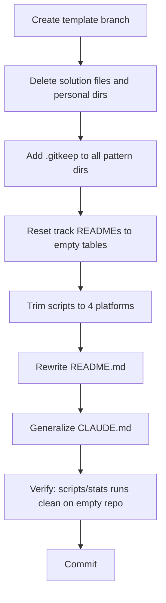

<!-- 581db98a-819c-4a31-9746-89a016983ce6 -->
---
todos:
  - id: "branch"
    content: "Create `template` branch from main"
    status: pending
  - id: "delete-solutions"
    content: "Delete all .py/.cpp solution files from problems/, remove codepath/ and index/ dirs, remove problems/inbox/codepath and problems/inbox/janestreet"
    status: pending
  - id: "gitkeep"
    content: "Add .gitkeep to every leaf directory under problems/ to preserve folder structure"
    status: pending
  - id: "delete-tracks"
    content: "Delete tracks/codepath_tip102, tracks/csc_2720, tracks/janestreet"
    status: pending
  - id: "reset-track-readmes"
    content: "Reset tracks/leetcode, codeforces, cf_edu, grind75 READMEs to have empty tables (header row only)"
    status: pending
  - id: "trim-scripts-new"
    content: "Remove tip102/csc2720 cases from scripts/new track-readme mapping"
    status: pending
  - id: "trim-gen-tracks"
    content: "Remove personal platforms from scripts/gen_tracks.py"
    status: pending
  - id: "trim-stats"
    content: "Remove personal platforms from scripts/stats PLATFORM_DISPLAY and iteration lists"
    status: pending
  - id: "delete-add-metadata"
    content: "Delete scripts/add_metadata.py (one-time migration script)"
    status: pending
  - id: "rewrite-readme"
    content: "Rewrite README.md as workshop-friendly getting-started template with zeroed stats"
    status: pending
  - id: "generalize-claude"
    content: "Generalize CLAUDE.md -- remove personal references, trim to 4 platforms"
    status: pending
  - id: "verify"
    content: "Run scripts/stats and scripts/new dry-check to verify everything works on the empty template"
    status: pending
isProject: false
---
# DSA Solutions Template Repo

## What stays (core infrastructure)

- **`problems/`** -- All 40+ pattern directories preserved as empty folders (via `.gitkeep`)
- **`templates/`** -- All 8 template files unchanged (`lc.py`, `lc.cpp`, `cf.py`, `cf.cpp`, `cf-edu.py`, `cf-edu.cpp`, `solution.py`, `solution.cpp`)
- **`scripts/new`** -- The solution scaffolding script (unchanged)
- **`scripts/stats`** -- The stats script (unchanged)
- **`scripts/gen_tracks.py`** -- Track README generation script (trimmed to 4 platforms)
- **`tracks/`** -- 4 universal tracks with empty table READMEs
- **`.gitignore`** -- Unchanged

## What gets removed

- **All solution files** in `problems/` (every `.py` and `.cpp`)
- **`codepath/`** directory (personal coursework)
- **`index/`** directory (unused CSV scaffold)
- **`scripts/add_metadata.py`** (one-time migration utility, not useful for template users)
- **Personal tracks**: `tracks/codepath_tip102/`, `tracks/csc_2720/`, `tracks/janestreet/`

## What gets modified

### 1. `problems/` -- Add `.gitkeep` to every leaf directory

Git does not track empty directories. Add a `.gitkeep` file to each of the ~40 pattern subdirectories so the structure is preserved on clone. Example:

```
problems/arrays/hashing/.gitkeep
problems/arrays/intervals/.gitkeep
...
problems/trees/traversal/.gitkeep
```

Also remove `problems/inbox/codepath/` and `problems/inbox/janestreet/` subdirs (personal). Keep `problems/inbox/` and `problems/scratch/` with `.gitkeep` as catch-all buckets.

### 2. `README.md` -- Rewrite as workshop template README

Replace personal stats and description with:
- Workshop-oriented title and intro ("DSA Solutions -- Your Interview Prep Repository")
- Quick start section: fork, clone, first problem walkthrough
- The pattern directory tree (already exists, keep it)
- Usage section with `./scripts/new` examples (already exists, keep it)
- Metadata format explanation (already exists, keep it)
- Empty stats block (`<!-- stats-start -->` / `<!-- stats-end -->` with zeroed table)
- Tracks section trimmed to 4 universal tracks
- A new "Getting Started" section with recommended first problems (e.g. LC #1 Two Sum, LC #121 Best Time to Buy/Sell Stock)

### 3. `CLAUDE.md` -- Generalize

- Change "Personal Data Structures..." to "Data Structures and Algorithms solutions repository"
- Remove references to personal coursework platforms (codepath_tip102, csc_2720, janestreet)
- Remove those platforms from the tracks table
- Update `scripts/new` platform mapping references accordingly

### 4. `tracks/` -- Reset to empty tables

Keep 4 track directories, each with a README containing only the header row:

- `tracks/leetcode/README.md` -- empty `| # | Problem | Pattern | Tags |` table
- `tracks/codeforces/README.md` -- same
- `tracks/cf_edu/README.md` -- empty with Course/Lesson column
- `tracks/grind75/README.md` -- empty table or curated checklist

Delete: `tracks/codepath_tip102/`, `tracks/csc_2720/`, `tracks/janestreet/`

### 5. `scripts/new` -- Trim platform cases

Remove the `tip102` and `csc2720` cases from the track-readme mapping (lines 103-108):

```bash
case "$platform" in
  lc)      track_readme="tracks/leetcode/README.md" ;;
  cf)      track_readme="tracks/codeforces/README.md" ;;
  cf-edu)  track_readme="tracks/cf_edu/README.md" ;;
esac
```

### 6. `scripts/gen_tracks.py` -- Trim to 4 platforms

Remove `tip102`, `csc2720`, and `janestreet` entries from `PLATFORM_MAP`, `FILENAME_PREFIX_MAP`, and `PATH_PLATFORM_MAP`.

### 7. `scripts/stats` -- Trim platform list

Remove `tip102`, `csc2720`, `janestreet` from the `PLATFORM_DISPLAY` dict and the ordered iteration lists.

## Execution order

All work happens on a new `template` branch created from `main`.


